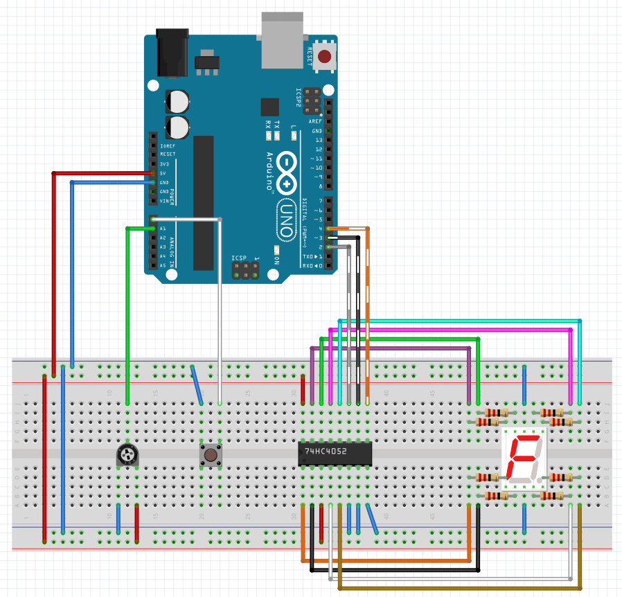

# 7segMUX

I used a 74HC4052 multiplexer, Arduino Uno, 7 segment LED, bush button and a potentiometer to explore how multiplexers work.


The multiplexer uses logic to route a single input to one of many outputs.  These ICs can help us out by reducing the number of outputs used on the Arduino.  Multiplexers are commonly used with LEDs because you can cycle through the different outputs of the multiplexer quick enough to give the illusion that multiple LEDs are on simultaneously.  


## Code

In order to see this first hand, I wrote a sketch that upon pressing a button it increments a number on the seven segment LED.  The potentiometer is used to adjust the rate in which the multiplexer cycles through each led of the display number.

Here is the code that controls the logic of displaying the number 4

```C++
// Use the multiplexer logic to illuminate each segment individually
void segB() {
  digitalWrite(S0, HIGH);
  digitalWrite(S1, HIGH);
  digitalWrite(S2, LOW);
}
void segC() {
  digitalWrite(S0, HIGH);
  digitalWrite(S1, HIGH);
  digitalWrite(S2, HIGH);
}
void segF() {
  digitalWrite(S0, HIGH);
  digitalWrite(S1, LOW);
  digitalWrite(S2, LOW);
}
void segG() {
  digitalWrite(S0, LOW);
  digitalWrite(S1, HIGH);
  digitalWrite(S2, LOW);
}

// Cycle through each segment, refresh rate is controlled by the potentiometer 
void display4() {
  segB();
  delay(refeshRate);
  segC();
  delay(refeshRate);
  segF();
  delay(refeshRate);
  segG();
  delay(refeshRate);
}
```

## Wiring Diagram

